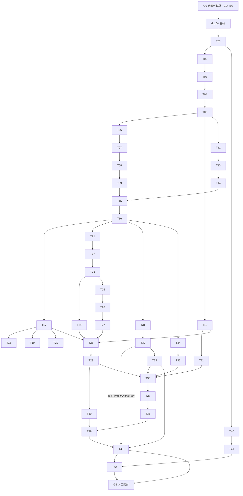

# GuardedCoder Implementation Plan

> **For agentic workers:** REQUIRED SUB-SKILL: Use superpowers:subagent-driven-development (recommended) or superpowers:executing-plans to implement this plan task-by-task. Steps use checkbox (`- [ ]`) syntax for tracking.

**Goal:** 按已签字 `SPEC.md` 实现 GuardedCoder CLI harness，不扩大范围。

**Architecture:** M4 评估 → M8 事务创建 permit 并保留预算 → M8 事务消费 permit 并建立执行窗口 → M5 **只验证**已消费 permit 与活动窗口后执行。M3 生命周期不用 LLM permit。配置 TOML+CLI 合成不可变信封。

**Tech Stack:** Python 3.12、pytest、argparse、Pydantic v2、tomllib、httpx、SQLite、keyring、defusedxml、系统 Git、pip-tools。禁止 agent framework。

## Global Constraints

- 以 `SPEC.md` 为准；本 PLAN 不放宽硬边界。
- CLI / 包名固定 `guardedcoder`。
- TDD：先红后绿；保存红灯证据。
- 每个实现 task 一个新鲜 subagent；commit/PR 注明来源与人工修改。
- 每个大模块一个 worktree / PR；**worktree 必须从依赖 PR 已合并的最新 `main` 创建**，禁止一次性从旧 base 开全部 worktree。
- **G0 已由产品负责人最终签署。G1 基线已提交**（`53075f05fc5097655d7f5b2f1113b2fbc884da4c`）。下一实现 task 为 T03（以状态表为准）。
- API Key 只进 keyring；不进 TOML/Git/日志/状态/记忆/Mock。
- 五工具 + `finish`；不为演示新增 network/push/publish。
- 完整 patch 禁止静默截断。
- 依赖锁定只用 pip-tools + `--generate-hashes`，**禁止 `pip freeze` 作为交付锁文件**。
- 假 key 测试字符串必须拼接构造（如 `"sk" + "-test"`），避免扫描器误报测试源码。
- 状态栏全部 pending / `—`，不得声称测试、冷启动、commit、PR、CI 已完成。
- G0 冷启动 agent 必须**类型不同于主开发 Cursor**；全新 session；不导入历史或 memory。**已读本设计史的 Codex 不可用**；**全新的、未见历史的 Codex task 可以使用**。

### 每个实现 task 的固定八步（约 2–5 分钟/步）

正文只写本 task 特有的测试意图与接口。执行时必须勾选：

- [ ] 写失败测试
- [ ] 跑红灯命令，记录预期失败
- [ ] 最小实现
- [ ] 跑绿灯命令
- [ ] 重构并回归测试
- [ ] spec 合规审查（Critical 必修）
- [ ] 代码质量审查（Critical 必修）
- [ ] commit（含 Subagent / Human edits）+ **追加 `AGENT_LOG.md`**（红灯/绿灯证据、subagent、人工修改、两阶段评审）+ **更新本 PLAN 状态栏 Status 与 commit hash**

Commit 模板：

```text
<type>: <summary>

Subagent: <id-or-model>
Human edits: <none|简述>
```

---

## 状态栏

| ID | 模块 | Status | Commit | PR / worktree |
|---|---|---|---|---|
| G0 | 冷启动（仓库外试做 T01+T02） | passed | — | G0 已签署；disposable 未进正式仓 |
| G1 | Git / GitHub / AGENT_LOG 基线 | done | 53075f05fc5097655d7f5b2f1113b2fbc884da4c | 正式仓 main；origin https://github.com/xinyue-L01/guardedcoder |
| T01 | 工程骨架 + pip-tools | done | 0421cc9463e304c1dadfd293aaab253108f8a4d5 | WT-A `.worktrees/wt-a-foundation`；已推送；Draft PR 未创建（gh 未安装） |
| T02 | 状态枚举 | done | ba3e36cb2ba812c57bc3f9340b1171b2495eb3ba | WT-A / PR-A |
| T03 | 动作 schema | pending | — | WT-A / PR-A |
| T04 | 信封模型 | pending | — | WT-A / PR-A |
| T05 | 指纹 | pending | — | WT-A / PR-A |
| T06 | AppConfig | pending | — | WT-B / PR-B |
| T07 | TOML 校验 | pending | — | WT-B / PR-B |
| T08 | 信封合成 | pending | — | WT-B / PR-B |
| T09 | 配置不能放宽硬规则 | pending | — | WT-B / PR-B |
| T10 | MockLLM | pending | — | WT-C / PR-C |
| T11 | OpenAICompatibleLLM | pending | — | WT-C / PR-C |
| T12 | 路径围栏 | pending | — | WT-D / PR-D |
| T13 | 硬规则与 profile 分码 | pending | — | WT-D / PR-D |
| T14 | 风险分类 | pending | — | WT-D / PR-D |
| T15 | 治理求交评估 | pending | — | WT-D / PR-D |
| T16 | SQLite、Task、AuditEvent 脱敏 | pending | — | WT-E / PR-E |
| T17 | M8 创建并消费 permit | pending | — | WT-E / PR-E |
| T18 | apply_patch 窗口恢复 | pending | — | WT-E / PR-E |
| T19 | run_command 窗口 fail-closed | pending | — | WT-E / PR-E |
| T20 | 审批一次性 | pending | — | WT-E / PR-E |
| T21 | 只读文件工具 | pending | — | WT-F / PR-F |
| T22 | apply_patch 管线 | pending | — | WT-F / PR-F |
| T23 | run_command + JUnit 路径占位符 | pending | — | WT-F / PR-F |
| T24 | M5 只验证已消费 permit | pending | — | WT-F / PR-F |
| T25 | exit_code sensor | pending | — | WT-G / PR-G |
| T26 | junit_xml（本次运行路径） | pending | — | WT-G / PR-G |
| T27 | verify 计划不执行 | pending | — | WT-G / PR-G |
| T28 | 主循环单步（正确 permit 序） | pending | — | WT-H / PR-H |
| T29 | finish 门闩 + PatchArtifactPort | pending | — | WT-H / PR-H |
| T30 | 反馈门控 MockLLM | pending | — | WT-H / PR-H |
| T31 | 脏树拒绝、创建/discard 归属 | pending | — | WT-I / PR-I |
| T32 | 完整 patch artifact | pending | — | WT-I / PR-I |
| T33 | apply-back 窗口 | pending | — | WT-I / PR-I |
| T34 | 记忆写入检索 + CLI 函数 | pending | — | WT-J / PR-J |
| T35 | 不授权、summary、100/90 清理 | pending | — | WT-J / PR-J |
| T36 | argparse CLI | pending | — | WT-K / PR-K |
| T37 | config / auth | pending | — | WT-K / PR-K |
| T38 | run/HITL/apply/discard/memory CLI | pending | — | WT-K / PR-K |
| T39 | 机制演示 | pending | — | WT-L / PR-L |
| T40 | 秘密扫描脚本（先于 CI） | pending | — | WT-M / PR-M |
| T41 | GitHub Actions + GitLab unit-test | pending | — | WT-M / PR-M（同分支，T40 之后） |
| T43 | 端到端离线任务生命周期 | pending | — | WT-N / PR-N |
| T42 | wheel / 许可证 / README / AGENT_LOG 审计 | pending | — | WT-O / PR-O（T43 与 T41 均完成后） |
| G2 | 人工最终交付 | pending | — | 依赖 T42 与 T43 |

---

## 文件结构（仅 G0 签字且 G1 完成后，在正式仓创建）

```text
requirements.in
requirements-dev.in
requirements.txt          # pip-compile --generate-hashes
requirements-dev.txt
pyproject.toml            # setuptools；见 T01 最小字段
Makefile                  # 可选；权威命令为 python -m pytest
.gitignore
AGENT_LOG.md              # G1 创建，此后每 task 追加
src/guardedcoder/
  models/__init__.py
  models/enums.py
persist/audit.py
workspace/discard.py
loop/ports.py             # PatchArtifactPort
scripts/secret_scan.py    # T40，T41 才调用
.github/workflows/ci.yml          # push/PR：测试+构建
.github/workflows/release.yml     # tag：wheel、SHA-256、GitHub Release
.gitlab-ci.yml            # 必须含 unit-test job
```

共享接口（禁止改名）：

- `parse_llm_response(raw: str) -> Action`
- `compute_fingerprint(*, schema_version, task_id, envelope_hash, base_commit, worktree_identity, normalized_action) -> str`
- `evaluate_action(action, envelope, task, worktree_root) -> GuardDecision`
- `TaskStore.create_permit(...)` — 原子保留预算并插入未消费 permit
- `TaskStore.consume_permit_and_open_window(...)` — **仅 M8**；原子消费 permit、写入 `executing_action` / ExecutionWindow
- `Executor.execute(authz, *, consumed_permit, active_window, ...)` — **M5 不调用 consume**；校验 permit 已消费且窗口活动，否则拒绝
- `LLMPort.complete(messages) -> str`
- `MockLLM` 可带 `require_verdict_status: str | None`：仅当 messages 中存在该 status 的 Verdict 文本才吐出下一修正动作
- `CommandProfile.argv_placeholders: list[str]` 可含 `{junit_out}`；harness 每次运行生成唯一输出路径并替换
- `PatchArtifactPort.export(task) -> PatchArtifact`（T29 用 stub；T32 接真实实现）
- `SCHEMA_VERSION = "1"`

Permit 顺序（所有循环/verify 必须遵守）：

```text
M4 evaluate
  → M8 create_permit（保留预算）
  → M8 consume_permit_and_open_window（副作用前）
  → M5 verify consumed permit + active window → 执行
  → M8 记录 observation
```

---

## Worktree / PR

| Worktree | 分支 | PR | Tasks | 创建基线 |
|---|---|---|---|---|
| 无 | 无 | 无 | G0 | 仓库外 disposable |
| 正式仓 | `main` | 无 | G1 | 初始化 |
| `wt-a-foundation` | `feat/a-foundation` | PR-A | T01–T05 | G1 后的 main |
| `wt-b-config` | `feat/b-config` | PR-B | T06–T09 | **PR-A 已合并的 main** |
| `wt-c-llm` | `feat/c-llm` | PR-C | T10–T11 | PR-A 已合并的 main |
| `wt-d-governance` | `feat/d-governance` | PR-D | T12–T15 | PR-A+B 已合并（T15 用硬规则） |
| `wt-e-persist` | `feat/e-persist` | PR-E | T16–T20 | PR-D 已合并的 main |
| `wt-f-tools` | `feat/f-tools` | PR-F | T21–T24 | PR-E 已合并的 main |
| `wt-g-sensors` | `feat/g-sensors` | PR-G | T25–T27 | PR-F 已合并的 main |
| `wt-h-loop` | `feat/h-loop` | PR-H | T28–T30 | PR-C+G 已合并的 main |
| `wt-i-workspace` | `feat/i-workspace` | PR-I | T31–T33 | PR-E 已合并的 main |
| `wt-j-memory` | `feat/j-memory` | PR-J | T34–T35 | PR-E 已合并的 main |
| `wt-k-cli` | `feat/k-cli` | PR-K | T36–T38 | PR-H+I+J 已合并的 main |
| `wt-l-demo` | `feat/l-demo` | PR-L | T39 | PR-K 已合并的 main |
| `wt-m-release` | `feat/m-release` | PR-M | T40→T41 | PR-A 已合并的 main。**T40→T41 仅同分支顺序完成，不把 T40 先合并进 main** |
| `wt-n-e2e` | `feat/n-e2e` | PR-N | T43 | PR-L+I 已合并的 main |
| `wt-o-docs` | `feat/o-docs` | PR-O | T42 | **PR-M 与 PR-N 均已合并的最新 main**（全部实现与 E2E 之后才做文档/AGENT_LOG 完整性审计） |

**禁止**在 G1 刚结束时一次性 `git worktree add` 出 A–O。

---

## 依赖图



**可并行：** PR-B / PR-C / PR-D 在 PR-A 合并后；PR-I 与 PR-J 在 PR-E 合并后；PR-M（T40→T41 同分支）与 PR-N（T43）可并行。  
**强制串行：** G0 → G1 → T01；T24 不得早于 T17；PR-M 内 T40 完成后在同一分支做 T41（不单独合并 T40）；T42 在 T41 与 T43 均完成（PR-M、PR-N 已合并）之后；G2 同时依赖 T42 与 T43。T29 单测用 stub port，真实导出在 T32，端到端在 T43。

---

## G0 冷启动验证（强制 gate）

**目标：** 陌生 agent 在**仓库外 disposable workspace** 实际试做 **T01 + T02**（不是只读文档）。试做时间目标约 **1–2 小时**。

**冷启动 agent 约束：**

- 类型必须**不同于主开发 Cursor**（例如全新 Codex task、Claude Code、Gemini CLI、OpenCode 等）。
- 必须使用**全新 session**。
- **不导入**本项目对话历史或 memory。
- **当前已读完整设计史的 Codex 不可使用。**
- **全新的、未见过本设计历史的 Codex task 可以使用。**

**网络（G0 专用，已按试做修订）：** 允许**仅**访问 PyPI（`https://pypi.org/simple`）以安装/解析开发依赖。禁止真实 LLM、API Key、其它网络服务、访问正式原项目目录、以及任何 push。

**前置：** `SPEC.md` + 本 `PLAN.md` 已人工审查。

**给陌生 agent 的材料：** 仅 `SPEC.md` 与 `PLAN.md` 副本。不给对话历史、memory、AGENT_LOG。

**允许：** 在 disposable workspace 写测试与最小实现、跑红灯/绿灯；按上条访问 PyPI。

**禁止：** 向正式 `codingAgentHarness` 合并、提交、复制产物；不 `git push` 正式远程。

### G0 试做记录（文档，非正式仓代码）

| 项 | 记录 |
|---|---|
| Agent | **OpenCode（glm-5.2）**，类型 ≠ Cursor |
| Session | 全新；无历史、无 memory |
| 耗时 | 约 **43 分钟**（目标 1–2 小时内） |
| T01 | 先红后绿 |
| T02 | 先红后绿 |
| 终态 | **4 passed** |
| 网络冲突 | 曾因网络/镜像暂停；有限授权后仅 PyPI 安装解析依赖 |
| 代码 | **未复制**任何 disposable 实现到正式仓库 |
| Status | **passed** |
| Commit | **—**（G0 不产生正式仓 commit） |

试做暴露并已回写 T01/T02/SPEC 的歧义：pyproject 最小字段、`models/__init__.py`、Windows 不以 make 验收、锁文件 index 必须是 pypi.org 且允许 `--allow-unsafe`、完整枚举集合。

**绿灯：** 产品负责人已最终签署 G0。**G0 已签署，进入 G1。**

Status: passed | Commit: —

---

## G1 仓库流程基线（G0 之后、正式 T01 之前）

**目标：** 正式仓可协作，且 AGENT_LOG 从现在开始存在。

**前置：** G0 已签署，进入 G1。

**路径：** Create: `.gitignore`, `AGENT_LOG.md`；git init；远程 GitHub。不写业务代码。

`.gitignore` 至少排除：`.env`、`.venv/`、`__pycache__/`、`dist/`、`build/`、`*.egg-info/`、`.guardedcoder/`（任务状态与 harness 管理 worktree）、`*.sqlite`、本地凭据、`.worktrees/` 内未跟踪产物。

`AGENT_LOG.md` 首条记录：brainstorming、Codex 审查角色、G0 冷启动（G0 完成后补细节）。

**步骤：**

- [x] `git init -b main`
- [x] 写安全 `.gitignore`
- [x] 写 `AGENT_LOG.md` 模板 + 已发生过程摘要
- [x] 提交 SPEC.md / PLAN.md / SPEC_PROCESS.md / .gitignore / AGENT_LOG.md 基线
- [x] 真实 GitHub origin：https://github.com/xinyue-L01/guardedcoder
- [x] 后续 worktree 规则已在 PLAN；AGENT_LOG 已记录

**绿灯：** 基线 commit `53075f05fc5097655d7f5b2f1113b2fbc884da4c`。**仍不得把 T01–T43 标 done。** 本回合不执行 T01。

Status: done | Commit: 53075f05fc5097655d7f5b2f1113b2fbc884da4c

---

## Task 01: 工程骨架 + pip-tools + setuptools

**状态：** done · 实现 commit `0421cc9463e304c1dadfd293aaab253108f8a4d5`

- [x] 写失败测试
- [x] 跑红灯命令，记录预期失败
- [x] 最小实现
- [x] 跑绿灯命令
- [x] 重构并回归测试
- [x] spec 合规审查（Critical 必修）
- [x] 代码质量审查（Critical 必修）
- [x] commit（含 Subagent / Human edits）+ 追加 `AGENT_LOG.md` + 更新本 PLAN 状态栏

**目标：** 可编辑安装；权威测试命令 `python -m pytest`；带 hash 的锁文件。不把私有/系统镜像 URL 写入提交的锁文件。  
**依赖：** G1 签字完成。  
**路径：** `pyproject.toml`, `requirements.in`, `requirements-dev.in`, `requirements.txt`, `requirements-dev.txt`, `src/guardedcoder/__init__.py`, `tests/test_pkg_import.py`；`Makefile` **可选**。

构建后端冻结为 **setuptools**。`pyproject.toml` 最小必须包含：

- `[build-system]`：`requires = ["setuptools>=68"]`，`build-backend = "setuptools.build_meta"`
- `[project]`：name `guardedcoder`，version，`requires-python = ">=3.12"`，dependencies
- src 包发现：`[tool.setuptools.packages.find] where = ["src"]`
- pytest：`[tool.pytest.ini_options]` 配置 `testpaths = ["tests"]`，`pythonpath = ["src"]`（或等价的 src layout）

`requirements.in`：pydantic、httpx、keyring、defusedxml。  
`requirements-dev.in`：`-r requirements.in`、pytest、pip-tools、build。

锁文件命令固定（提交的 lock 必须使用该 index，禁止写入用户机器的私有/系统镜像 URL）：

```text
python -m piptools compile --generate-hashes --allow-unsafe --index-url https://pypi.org/simple requirements.in
python -m piptools compile --generate-hashes --allow-unsafe --index-url https://pypi.org/simple requirements-dev.in
```

失败测试：`import guardedcoder` 且 `__version__=="0.1.0"`。  
红灯：`python -m pytest tests/test_pkg_import.py -v` → ModuleNotFoundError。  
绿灯：同一命令 PASS。`make test` 若存在，仅封装 `python -m pytest`；**Windows 不以 make 为验收前提。**

---

## Task 02: RunState / ArtifactState

**状态：** done · 实现 commit `ba3e36cb2ba812c57bc3f9340b1171b2495eb3ba`

- [x] 写失败测试
- [x] 跑红灯命令，记录预期失败
- [x] 最小实现
- [x] 跑绿灯命令
- [x] 重构并回归测试
- [x] spec 合规审查（Critical 必修）
- [x] 代码质量审查（Critical 必修）
- [x] commit（含 Subagent / Human edits）+ 追加 `AGENT_LOG.md` + 更新本 PLAN 状态栏

**依赖：** T01。  
**路径：** `src/guardedcoder/models/__init__.py`, `src/guardedcoder/models/enums.py`, `tests/test_enums.py`

使用 Python 3.12 **`enum.StrEnum`**（不要只用 `str, Enum` 混写一套未冻结实现）。

必须实现 SPEC §6.5 **全部**成员，测试断言完整集合，而不是只测三个示例值：

- `RunState`：`awaiting_envelope`, `running`, `awaiting_approval`, `awaiting_envelope_revision`, `executing_action`, `verifying`, `succeeded`, `failed`, `blocked`, `unverified`, `exhausted`, `error`
- `ArtifactState`：`worktree_present`, `patch_ready`, `applying`, `applied`, `discarded`, `cleanup_error`

失败测试：上述 `set(RunState)` / `set(ArtifactState)` 与成员字符串全等；`RunState` 无 `applied`。  
红灯：`python -m pytest tests/test_enums.py -v` → import 失败或集合不全。  
绿灯：同一命令 PASS。

---

## Task 03: 动作 schema

**依赖：** T02。路径：`models/actions.py`, `errors.py`, `tests/test_actions.py`  
失败测试：合法 `list_dir`；`{"action":"network"}` 与 extra 字段、超大 JSON → `ActionParseError`。  
红灯：`pytest tests/test_actions.py -v`。

---

## Task 04: Envelope / CommandProfile

**依赖：** T03。路径：`models/envelope.py`, `tests/test_envelope.py`  
`frozen=True, extra=forbid`；`envelope_hash` 稳定；profile 可含 `junit_out` 占位说明字段 `argv_template: list[str]`。  
失败测试：两次 hash 相等；未知字段 ValidationError。

---

## Task 05: 指纹绑定上下文

**依赖：** T04。路径：`fingerprint.py`, `tests/test_fingerprint.py`  
失败测试：仅 `task_id` 不同则 fingerprint 不同；相同输入稳定。

---

## Task 06: AppConfig

**依赖：** T05。路径：`models/config.py`, `tests/test_appconfig.py`  
失败测试：合法 dict 通过；`api_key` 或未知键 ValidationError。

---

## Task 07: TOML fail closed

**依赖：** T06。路径：`config/paths.py`, `config/load.py`, `tests/test_config_load.py`  
失败测试：未知键 / shell 字符串 / secret-like 值 → `ConfigError`；合法文件两次 load 相等。不读 `.env`。

---

## Task 08: 合成信封

**依赖：** T07。路径：`config/synthesize.py`, `tests/test_synthesize.py`  
失败测试：CLI 覆盖 `max_steps`；未覆盖字段等于配置默认；最终有效值而非 diff。

---

## Task 09: 配置不能放宽硬规则

**依赖：** T08。路径：`governance/hard_rules.py`, `tests/test_config_hard_rules.py`  
失败测试：`pip`+`install` 或 push/publish profile → ConfigError。

---

## Task 10: MockLLM

**依赖：** T05。路径：`llm/port.py`, `llm/mock.py`, `tests/test_mock_llm.py`  
序列响应；耗尽异常；messages 含拼接假 key 则 `SecretLeakError`。  
T30 将扩展门控行为，本 task 只做序列。

---

## Task 11: OpenAICompatibleLLM

**依赖：** T10。路径：`llm/openai_compat.py`, `tests/test_openai_compat.py`  
远程 HTTP+key 拒绝且不发请求；loopback HTTP 允许；`follow_redirects=False`；3xx 不跟。  
假 key 用 `"sk"+"-test"` 传入 fake key_provider。

---

## Task 12: 路径围栏

**依赖：** T05。路径：`tools/paths.py`, `governance/fence.py`, `tests/test_fence.py`  
`../` 与指向树外的 symlink → `WORKSPACE_ESCAPE`；`.env` → `SENSITIVE_PATH`。

---

## Task 13: 未知 vs 硬禁止 profile

**依赖：** T09, T12。路径：`tests/test_hard_rules.py`  
未知 → `unknown`；硬禁止 → `hard_forbidden`。不得合成进信封。

---

## Task 14: 风险分类

**依赖：** T13。路径：`governance/classify.py`, `models/permit.py`, `tests/test_classify.py`  
树内越写范围 HITL；逃逸 Deny；允许路径修改 Allow。

---

## Task 15: evaluate 求交

**依赖：** T14。路径：`governance/evaluate.py`, `models/task.py`, `tests/test_evaluate.py`  
未知 profile → `NeedEnvelopeRevision/COMMAND_NOT_ALLOWED`；预算 0 → Deny；后层不能把 Deny 改 Allow。

---

## Task 16: SQLite + AuditEvent 脱敏

**依赖：** T15。路径：`persist/db.py`, `persist/store.py`, `persist/audit.py`, `tests/test_db.py`, `tests/test_audit.py`

表含 `audit_events` FK。`append_audit(event)` 将值中匹配 key 形态的子串替换为 `[redacted]`。  
失败测试：错误 `state_revision` 更新失败且字段不变；审计写入含 `"sk"+"-live"` 的假输入后库内无该拼接结果。

---

## Task 17: M8 创建 permit 与消费+开窗

**依赖：** T16。路径：`persist/permit.py`, `tests/test_permit.py`

`create_permit` 保留预算、插入未消费 permit。  
`consume_permit_and_open_window` 消费并写 `executing_action` + ExecutionWindow。  
第二次消费 → `PermitConsumedError`。  
失败测试：create 后 remaining_steps-1；consume 前 M5 尚未存在；双消费失败。  
**禁止**把 consume 放进 executor。

---

## Task 18–T19: 执行窗口恢复

**依赖：** T17。路径：`persist/recover.py`, `tests/test_recover_patch.py`, `tests/test_recover_command.py`  
apply_patch：全 post 补记成功；全 pre 同一次重试；混合 error。  
run_command 停在 executing_action → error，spy 执行次数 0。

---

## Task 20: 审批一次性

**依赖：** T17。路径：`persist/approval.py`, `tests/test_approval.py`  
`approve(task_id, fingerprint)`；仅 task_id 的 API 不存在。错误指纹/二次消费/信封 hash 变后旧指纹均失败。

---

## Task 21–T22: 读工具与原子 apply_patch

**依赖：** T12, T17。路径：`tools/list_dir.py|read_file.py|search_text.py|apply_patch.py` 及对应测试。  
读 `.env` 失败；双文件补丁第二 hunk 失败则两文件均未改。

---

## Task 23: run_command 与 `{junit_out}`

**依赖：** T22。路径：`tools/run_command.py`, `models/verdict.py`, `tests/test_run_command.py`

`shell=False`。每次运行 harness 在任务目录生成唯一 `junit_path`，替换 argv 中 `{junit_out}`。  
`CommandResult.junit_path` 为该路径。无 PASS/FAIL 字段。  
失败测试：timeout 置 `timed_out`；argv 实际包含生成路径而非字面 `{junit_out}`。

---

## Task 24: M5 只验证已消费 permit

**依赖：** T17, T23。路径：`tools/executor.py`, `tests/test_executor.py`

`execute` **不得**调用 `create_permit` 或 `consume_permit_and_open_window`。  
输入必须带已消费 permit id + 活动 window id；否则 `UnauthorizedError` 且不改文件。  
失败测试：裸 Action 拒绝；未消费 permit 拒绝；窗口缺失拒绝。

---

## Task 25: exit_code sensor

**依赖：** T23。路径：`sensors/exit_code.py`, `tests/test_sensor_exit.py`  
exit 0 PASS；timeout TIMEOUT；started False ERROR。

---

## Task 26: junit_xml 属于本次运行

**依赖：** T25。路径：`sensors/junit_xml.py`, `tests/test_sensor_junit.py`

**不要**要求 pytest 写自定义 XML token。  
“属于本次运行”= `result.junit_path` 等于 harness 本次生成路径且文件存在；缺失/空/坏 XML → ERROR 不得 PASS。  
失败测试：路径不存在 ERROR；合法 failures=1 FAIL。用 defusedxml。

---

## Task 27: verify 计划

**依赖：** T26。路径：`sensors/plan.py`, `tests/test_verify_plan.py`  
只返回 `verify_profile_ids`；源码不含 `run_profile`。

---

## Task 28: 主循环单步

**依赖：** T10, T15, T24, T27。路径：`loop/engine.py`, `loop/context.py`, `tests/test_loop_step.py`

Spy 顺序：`evaluate` → `create_permit` → `consume_permit_and_open_window` → `executor.execute`。  
`execute` 调用时 permit 已 consumed。HITL 则 `awaiting_approval` 且不执行。

---

## Task 29: finish 门闩 + PatchArtifactPort

**依赖：** T28。路径：`loop/ports.py`, `tests/test_finish.py`；修改 `engine.py`

无 verify → `unverified`（不需要真实 git diff）。  
有 verify：每个 profile 再走 T28 同一 permit 序；sensor 非全 PASS 不得 `succeeded`。  
`succeeded` 还要求 `PatchArtifactPort.export` 未超限。  
本 task 使用 **stub port**（可返回固定小 patch 或 over_limit）。  
真实 git 导出在 T32；与循环集成在 T43。  
verify 期间 `run_state=verifying`，不切回 `executing_action`。

---

## Task 30: 反馈必须被看到才改动作

**依赖：** T29。路径：修改 `llm/mock.py`, `tests/test_feedback_loop.py`

**禁止**仅用无条件预设序列证明“反馈导致改动作”。  
`MockLLM(responses=..., gate_on_fail=True)`：修正动作（如第二次 apply_patch）仅当 messages 中出现 `FAIL` Verdict 结构化文本才返回；否则返回 `finish/blocked` 或耗尽。  
失败测试：不注入 FAIL 时不会发出修正 patch；注入 FAIL verdict 后下一步 fingerprint 改变。

---

## Task 31: 脏树、创建与 discard 归属

**依赖：** T16。路径：`workspace/gitops.py`, `worktree.py`, `discard.py`, `tests/test_worktree.py`

`assert_clean` 拒绝 tracked/untracked，不 stash。  
`create_task_worktree` 在 harness 目录从 `base_commit` 创建，记录归属 `{task_id, repo_real_path, base_commit}`。  
`discard_worktree(task_id, requested_path)`：路径必须等于已记录 worktree 且归属匹配，否则不删除。  
LLM 不得提供任意清理路径（CLI 只传 task_id）。  
生命周期窗口：discard 前校验归属；失败 → 不删，`cleanup_error` 可选。

---

## Task 32: 完整 patch artifact

**依赖：** T31。路径：`workspace/artifact.py`, `tests/test_patch_artifact.py`  
实现 `PatchArtifactPort`。超限 `over_limit=True` 且 body 仍完整；`can_mark_patch_ready` 为 False。summary 可截断但含 sha256 与路径。

---

## Task 33: apply-back 窗口

**依赖：** T32, T18。路径：`workspace/apply_back.py`, `tests/test_apply_back.py`  
仅 `succeeded`+`patch_ready`。确认前不改原树。`applying` 恢复：全 post→applied；全 pre→须再确认；混合→cleanup_error。

---

## Task 34: 记忆存储、检索、CLI 函数

**依赖：** T16。路径：`memory/store.py`, `retrieve.py`, `tests/test_memory.py`

`add_constraint` / `add_decision`（supersede）/ `list_records` / `export_records` / `clear_repo(repo_id)`。  
`clear` 必须指定仓库标识。相同检索输入相同 Top-N。疑似密钥拒绝写入。  
CLI 接线在 T38，本 task 提供纯函数。

---

## Task 35: 记忆不授权 + summary + 保留策略

**依赖：** T34, T15。路径：`memory/summarize.py`, `tests/test_memory_trust.py`

记忆声称允许某命令，evaluate 仍拒绝。  
`build_task_summary` 不含完整 diff。  
`gc_task_summaries`：保留最近 100 条 **且** 最长 90 天（同时约束）；任务结束后调用。  
失败测试：101 条只留 100；91 天前的被删。

---

## Task 36: argparse 骨架

**依赖：** T08。路径：`cli.py`, `tests/test_cli_parse.py`  
子命令：`run approve reject resume apply discard auth config memory`。未知命令非 0。  
`approve` 两个位置参数 `task_id fingerprint`。

---

## Task 37: config 与 auth

**依赖：** T36, T07, T11。路径：`auth/keyring_store.py`, `tests/test_cli_config_auth.py`  
`config init|validate|show`；`auth set|status|update|clear`。show/status 不含明文。keyring 失败不写文件。假 key 拼接。

---

## Task 38: 产品 CLI 集成

**依赖：** T20, T29, T31, T33, T35, T37。路径：修改 `cli.py`, `tests/test_cli_hitl.py`, `tests/test_cli_lifecycle.py`

覆盖：`run --confirm-envelope-hash`（无确认则不建 worktree、不调 LLM）；  
`approve`/`reject`/`resume` 均要 task_id+fingerprint（reject/resume 对无 pending 的校验按 SPEC：resume 恢复校验失败 → error）；  
`apply`/`discard` 走 M3；  
`memory add|list|export|clear`。

---

## Task 39: 机制演示

**依赖：** T30, T38。路径：`demos/mechanism_demo.py`, `tests/test_mechanism_demo.py`  
离线四场景：护栏、FAIL 门控反馈、指纹/permit/窗口、非法 TOML。不扩工具面。

---

## Task 40: 秘密扫描（必须先于 CI）

**依赖：** T01。路径：`scripts/secret_scan.py`, `tests/test_secret_scan.py`

扫描工作区排除 `.git`。命中私钥头或典型 key 形态则退出 1。  
测试用拼接假 key 写入临时文件断言检出；测试源码本身不得出现连续真值形态。  
**本 task 在 PR-M 同分支上完成后立刻做 T41**（顺序完成，不必先把 T40 合并进 main）。禁止 CI stub。

---

## Task 41: CI

**依赖：** T40。路径：`.github/workflows/ci.yml`, `.github/workflows/release.yml`, `.gitlab-ci.yml`, `tests/test_ci_files.py`

GitHub Actions **push/PR**：从 lock `pip install --require-hashes`（或 pip-tools 等价）、跑 pytest、构建 wheel、跑 `scripts/secret_scan.py`。  
**tag workflow：** 构建 wheel、生成 SHA-256、创建 GitHub Release 并上传资产。  
`.gitlab-ci.yml` 必须有名为 `unit-test` 的 job，同样从 lock 安装并 pytest。  
失败测试：断言文件存在且含 `unit-test:`、`secret_scan`、`pip-compile` 产物安装方式。  
**不得声称远程 CI 已 pass。**

---

## Task 42: wheel、许可证、README、AGENT_LOG 完整性审计

**依赖：** T41 与 **T43**（全部实现与 E2E 完成之后）。路径：`README.md`, `LICENSE`, `THIRD_PARTY_LICENSES.md`, `scripts/hash_wheel.py`, `tests/test_release_docs.py`

**不创建** AGENT_LOG（G1 已有）。本 task **审计**：每个已完成实现 task 在 AGENT_LOG 有对应条目；缺则测试失败。  
README 必须章节：简介、安装、运行、分发、目录结构、安全边界、凭据、已知限制。校验和不得写成抵御平台整体失陷。  
本地可 `python -m build`；不声称 Release 已存在。

---

## Task 43: 端到端离线生命周期

**依赖：** T32, T38, T39。路径：`tests/test_e2e_offline.py`

一条 pytest：MockLLM + fake runner + 临时 git 仓：确认信封 → 运行 → HITL 暂停 → approve+resume → finish 经 verify（stub 或真实 junit 路径）→ `succeeded`+`patch_ready` → apply HITL → 原树变更。  
另：中途进程“崩溃”模拟 `executing_action` 恢复规则。  
全程无网络、无真实 LLM。

---

## G2 最终人工交付 gate

**依赖：** **T42 与 T43 均完成**（文档审计在 E2E 之后；交付在两者之后）。无实现代码。AI **不代写** `REFLECTION.md`。

- [ ] 最后一次 GitHub Actions 记录为 pass（人工粘贴 run URL 到 AGENT_LOG；PLAN 此刻仍不预填）
- [ ] 创建真实 GitHub Release；验证 `pipx install <release-wheel-url>`
- [ ] 机制演示记录写入 AGENT_LOG
- [ ] 学生本人撰写 1500–2500 字 `REFLECTION.md`（可用 AI 润色但须标注；禁止代写）
- [ ] README 填入真实仓库与 Release URL
- [ ] 从课程原始模板填写 `submission.jsonc`：**不改文件名**、不放进源码压缩包；`is_deployed: false`，`deploy_release_url` 为 Release 链接
- [ ] 生成源码+文档压缩包；`submission.jsonc` 与压缩包并列提交

Status: pending | Commit: —

---

## PLAN 作者自检

| 审查项 | 位置 |
|---|---|
| 1 G0 仓库外试做 T01+T02；非 Cursor；全新 session；未见史 Codex task 可用 | G0 |
| 2 G1 Git/gitignore/AGENT_LOG/GitHub/worktree 基线 | G1 |
| 3 AGENT_LOG 每 task 追加；T42 只审计 | 固定八步、G1、T42 |
| 4 permit M8 消费、M5 只验证 | 共享接口、T17、T24、T28 |
| 5 T29 stub port + T32/T43；T30 门控；JUnit 路径 | T23/T26/T29/T30/T43 |
| 6 discard、CLI 全家、memory CLI、100/90、审计、e2e | T16/T31/T34/T35/T38/T43 |
| 7 pip-tools hashes | T01、T41 |
| 8 扫描先于 CI；拼接假 key；push/PR vs tag | T40、T41、T11/T16 |
| 9 G2 人工交付 | G2 |
| 10 八步展开；不写 PLAN 未生成 | 文首八步；SPEC_PROCESS |

未声称任何 gate/task 已完成。本修订不执行 G0。
