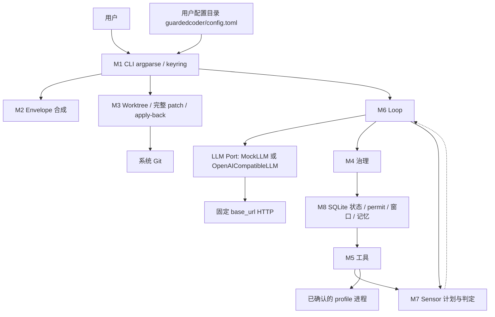
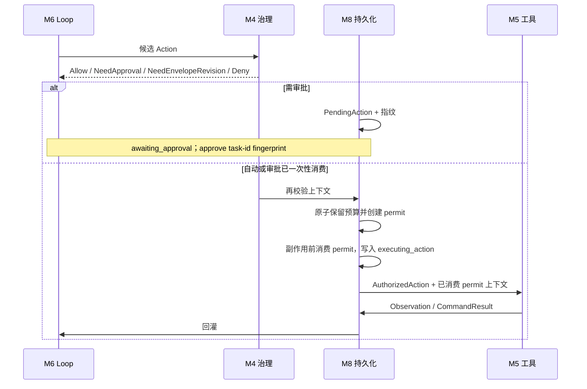
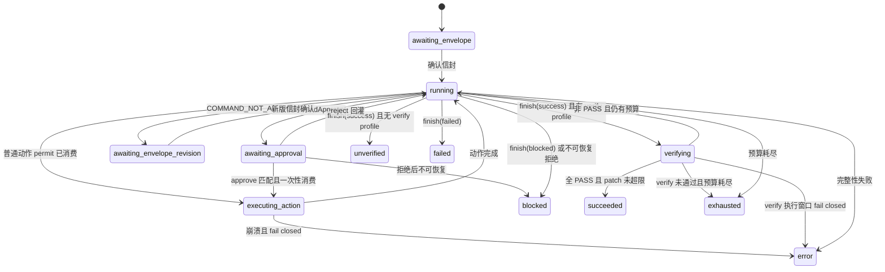

# GuardedCoder 设计规约（SPEC）

- 产品名：GuardedCoder
- CLI：`guardedcoder`
- 版本：首版（v0）
- 状态：五块设计已由产品负责人签字确认；冷启动验证尚未进行
- 日期：2026-08-13

本文整合 brainstorming 已签字设计，不扩大、不缩小、不改写已确认范围。实现必须以本文为准。

---

## 1. 问题陈述

个人开发者可以把边界清楚的小编码任务交给 agent：读代码、打补丁、跑检查、按失败结果做有限次自我修正。LLM 不可信，不能在本机无约束改文件或跑命令。现成编码助手把 harness 藏在产品里，安全多靠提示词；去掉真实模型后无法证明护栏仍在。

GuardedCoder 是自研 CLI harness：LLM 只产出「调用哪个已声明工具」或 `finish`。路径围栏、策略信封、动作指纹、一次性执行许可、HITL、verify 门闩、记忆检索和停机全部是确定性代码。成功时默认只给出完整 patch 与摘要，不自动修改用户原工作树。

核心等式：`Agent = LLM + Harness`。Cursor / Superpowers 是开发工具，不能充当本产品运行时内核。

---

## 2. 目标用户与范围

### 2.1 目标用户

在本地、已初始化且至少有一个 commit 的 Git 仓库中开发，希望把**单个、边界明确**的小型编码任务交给 agent，又不愿其无约束执行命令或修改文件的个人开发者。

不是 Cursor 替代品，也不是课程演示器。可复现与可审计是工程属性。

### 2.2 首版做

- 只提供 CLI，不提供 WebUI，不做云部署。
- 单仓库、单任务、单隔离 worktree。
- 启动前原工作树必须干净（无未提交的 tracked / untracked 变更）；不干净则拒绝启动，不自动 stash / commit / 删除。
- 每次任务生成可确认的策略信封；每个已确认版本不可变；扩大范围必须生成新版本并重新确认。
- LLM 的文件类工具只能访问任务 worktree；LLM 还会收到有界的任务描述、检索记忆、动作结果和验证反馈。LLM 只能输出五类工具调用（`list_dir` / `read_file` / `search_text` / `apply_patch` / `run_command`）或 `finish`。
- 客观 sensor：`exit_code`、`junit_xml`。`finish(success)` 必须重跑全部 `verify_profiles`，且走治理与执行许可，不能由 sensor 模块直接跑命令。
- 主贡献为治理：策略组合、HITL 状态机、绑定执行上下文的动作指纹、一次性 ExecutionPermit、工作区围栏、跨进程暂停恢复、执行窗口 fail-closed 恢复。
- 仓库级结构化记忆；记忆不能放宽策略。
- 声明式配置：OS 用户配置目录下的 versioned TOML；与 CLI 合成为待确认信封；硬拒绝规则由代码定义，配置不能关闭或放宽。
- OS keyring 存 API Key；自研 OpenAI-compatible 单次 HTTP 客户端 + `MockLLM`。
- GitHub 为源码仓库与 Release 平台；GitHub Actions 构建测试与 wheel；同时保留 `.gitlab-ci.yml`（含 `unit-test` job）。运行前提为 Python 3.12+、pipx/wheel、系统 Git。

### 2.3 首版不做

- 多 agent 编排；自动 push / 发布 / 部署 / merge / commit。
- 操作系统级进程沙箱或子进程网络隔离。
- 任意 shell 字符串、`write_file` / 字符串替换 / 整文件覆盖。
- 向 LLM 开放 Git 工具。
- 向量记忆 / embedding / 现成 agent memory。
- LLM 直接增删改长期记忆。
- 脏工作树启动。
- 用一次动作审批静默扩大信封。
- 用审批放行：工作区逃逸、敏感凭据、提权、push/发布/部署、安装或更新依赖。
- 为演示拒绝而新增 network / push / publish 工具。
- 单文件 exe、自动加载 `.env`、把 API Key 写入 TOML、用配置关闭硬拒绝、静默截断完整 patch 交付物。

### 2.4 前提与非宣称

- 目标仓库与用户预先确认的 command / verify profile 本身可信；用户应选择无网络副作用的 profile。
- 测试命令以当前用户权限在宿主机执行。围栏约束的是 harness 文件工具、动作 schema、策略与 permit，不是 OS 沙箱。
- 不向 LLM 提供通用网络工具；LLM 不能临时构造 curl / push / publish 等网络命令；push / 发布 / 部署为产品级硬拒绝。
- LLM Provider HTTP 是 harness 内部控制通道，只能访问用户配置的固定 `base_url`。
- 合法动作 schema 中不存在 network、push 或 publish 工具。未知此类 action 在 schema 解析阶段拒绝；经 `run_command` 引用未知或禁止 profile 在策略校验阶段拒绝。

---

## 3. 用户故事

故事遵循 INVEST。评分者不是产品用户；离线机制演示见第 12.2 节。

**US-1 确认策略信封后再开工**  
作为开发者，我指定仓库和自然语言任务后，先看到由声明式配置与本次 CLI 选择合成的最终有效信封：规范化工作区真实路径、允许读写范围、command profile、预算、网络/删除策略，以及原工作树是否干净（首版必须干净才能继续），确认后才启动。  
验收：未确认不创建 worktree、不调 LLM；每个已确认版本不可变；扩大范围生成新版本并重新确认；单次动作审批不能改变策略。

**US-2 隔离完成小任务并拿到补丁**  
作为开发者，我交出一个边界明确的任务，agent 只在隔离 worktree 里读、打补丁、跑允许的检查并自我修正；原工作树不被 LLM 文件工具修改。  
验收：原仓库路径与 base commit 在任务执行中不变；交付完整 patch artifact（不静默截断）以及可截断的摘要（标注截断、完整 artifact 哈希与位置）。

**US-3 危险动作按指纹审批**  
作为开发者，对可审批的中高风险动作，我看到规范化动作、风险原因、影响范围和指纹，可批准或拒绝。  
可审批仅包括：删除或重命名 worktree 内文件；写入仍在 worktree 内但超出当前写入范围的路径；超过策略阈值的较大补丁；其他被治理规则明确分类为可审批的中高风险动作。  
不属于普通动作审批：未知 command profile 返回 `NeedEnvelopeRevision(code=COMMAND_NOT_ALLOWED)`，不执行，只能确认新版信封；安装或更新依赖首版不支持，单动作审批也不能放行；工作区外路径、敏感凭据、提权、push、发布硬拒绝。  
路径二分：规范化后仍在 worktree、仅越写入范围 → HITL；逃出 worktree（穿越/符号链接）→ 硬拒绝。  
验收：非交互 `guardedcoder approve <task-id> <fingerprint>`；TTY 也必须展示 task ID、风险、动作摘要与可核对指纹；仅 task ID 或单纯 y/n 不能消费待批动作；批准只执行与指纹完全相同的规范化动作；审批绑定 pending action 与 `state_revision` 且只能消费一次；拒绝结果回灌 agent；多个动作不能打成一次审批。

**US-4 硬边界不可放行**  
作为开发者，文件工具不能逃出任务 worktree，也不能读取敏感路径；治理层拒绝 LLM 直接请求的网络 / push / 发布类动作。即使我尝试批准，硬边界也不得变成一次普通动作放行。  
验收：mock 文件动作命中逃逸或敏感路径 → 硬拒绝且不执行、不进入待批；未知 action（含虚构的 network/push/publish）在 schema 解析拒绝；硬禁止 profile → `Deny(code=HARD_FORBIDDEN_COMMAND)`。不验收任意测试进程是否还能联网。

**US-5 跨进程暂停与恢复**  
作为开发者，进程退出后我仍能对同一 task 按 task ID + 指纹批准/拒绝并恢复。  
验收：恢复前校验信封哈希、worktree 归属、base commit、待批内容与指纹、状态完整性；任一项失败 → `error`，不猜测执行。执行窗口崩溃恢复见第 4.6 节与第 5 节 M8。

**US-6 没有通过验证就不能算成功**  
作为开发者，成功结束意味着必需 verify 当时全部 PASS。  
验收：`finish(success)` 忽略缓存，由主循环为每个 verify profile 重新经治理、permit 与工具执行，再由 sensor 解析；全部 PASS 且完整 patch 未超总变更上限才允许 `succeeded`；无 verify profile 时 `finish(success)` 确定性进入 `unverified`。

**US-7 显式 apply 回原工作树**  
作为开发者，我执行 `guardedcoder apply <task-id>`。仅当 `run_state=succeeded` 且 `artifact_state=patch_ready`。必须先重新验证原树干净、base commit 未变化、patch 可应用，然后展示 patch 摘要和指纹，等待明确确认。确认前不得修改原树。确认后进入 apply 执行窗口。  
验收：预检失败不改原树；未确认不改原树；不自动 commit / merge / push；崩溃恢复见第 5 节 M3。

**US-8 记忆可检索但不能授权**  
作为开发者，我用 CLI 写入项目约定和决策；任务摘要由 harness 生成；agent 只能读到有预算的检索结果。  
验收：同样检索输入得到同样 Top-N；记忆声称“允许某命令”也不扩大信封；LLM 无记忆写工具；疑似密钥拒绝写入且日志不含原值。

**US-9 凭据只进 keyring**  
作为开发者，我用隐藏输入配置 key，并能看状态、更新、清除。  
验收：`auth set|status|update|clear`；status 无明文；不自动加载 `.env`；keyring 不可用则报错，不回退明文文件；远程携带 key 的 endpoint 必须 HTTPS 等规则见第 9 节。

**US-10 声明式配置生成可确认信封**  
作为开发者，我用用户配置目录中的 TOML 保存可复用的非敏感默认值，并用 CLI 覆盖本次任务选项；启动时看到合成后的最终有效信封再确认。  
验收：`config init|validate|show`；`show` 与信封展示均不含秘密；相同配置输入 + 相同 CLI 选择得到相同有效配置；非法 TOML（未知字段、错误类型、硬禁止 profile、shell 字符串、secret-like 字段）fail closed，不建 worktree、不调 LLM；配置不能关闭或放宽代码中的硬拒绝规则。

---

## 4. 领域与机制设计

六个 harness 维度（决策、工具、记忆、治理、反馈、配置）都有最低可运行实现；深入只做治理。TOML 正文、规则样例和提示词是内容物，不计入实现工作量；**加载、schema 校验、与 CLI 合成信封、拒绝用配置放宽硬规则**是 harness 代码，必须可单测。判定标准：移除真实 LLM 后，机制仍能用 mock / stub 做确定性单测。

### 4.1 动作 / 工具

Agent 能做的事只有：在任务 worktree 内列目录、读文本、搜文本、打规范化 unified diff、按已确认 command profile 跑进程，以及 `finish`。

写入只有 `apply_patch`：解析 unified diff → 规范化并验证全部目标路径 → 拒绝穿越/逃逸/敏感路径/二进制补丁 → 检查文件数、补丁大小、变更行数上限 → 检查全部 hunk 可应用性 → 风险分类 → 全部通过后原子应用，不能只应用一半。

`run_command` 只引用信封内 `profile_id`、经该 profile 参数规则校验的可选参数、worktree 内相对 cwd。始终结构化 argv 且 `shell=false`。

Git worktree、状态检查、diff 计算、patch 导出、清理由 harness 内部实现，不向 LLM 开放 Git 工具。每次成功的 `apply_patch` 后，harness 自动把有大小限制的变更摘要（可截断，须标完整 artifact 哈希与位置）作为 observation 回灌。

### 4.2 客观反馈

command profile 必须声明 sensor 类型。首版两个：

1. `exit_code`：0 → 将由 sensor 判 PASS；非 0 → FAIL；超时 → TIMEOUT；未能按约束完成（未启动、输出违例等）→ ERROR。适用于 lint、类型检查、构建和简单测试。
2. `junit_xml`：解析命令生成的 JUnit XML；输出总数/失败/错误/跳过及有界失败用例。文件缺失、格式错误或与本次运行不对应 → ERROR，不得误判 PASS。

统一 `Verdict` 至少包含：profile ID、sensor 类型、`PASS|FAIL|TIMEOUT|ERROR`、exit code、有界摘要、结构化失败条目、原始输出是否截断、原始输出摘要哈希、耗时。

stdout/stderr 只作诊断。真正成败由 sensor 代码从 `CommandResult` 产生，不由 LLM 阅读日志决定。工具模块不自行给出 PASS/FAIL/TIMEOUT/ERROR。

### 4.3 危险动作（三档）

| 档 | 含义 | 例 |
|---|---|---|
| 自动 | 当前信封内、低风险 | 允许路径上的创建/修改补丁；已确认 profile 的测试/lint |
| HITL | 可批准，指纹绑定，一次性消费 | worktree 内删除/重命名；worktree 内超出写入范围；超阈值大补丁；规则标明可审批的中高风险 |
| 硬拒绝 | 不能经本次动作审批放行 | 逃出 worktree、敏感路径、提权/破坏、push/发布/部署、装依赖、硬禁止 profile |

未知但不属于硬禁止类别的 profile：`NeedEnvelopeRevision(code=COMMAND_NOT_ALLOWED)`。产品级禁止 profile：`Deny(code=HARD_FORBIDDEN_COMMAND)`，不得通过新版信封加入。

### 4.4 记忆

仓库级结构化记忆，存于 harness 管理目录，按规范化仓库标识隔离，不写入目标代码仓库。不做 embedding。

| 类型 | 写入权 | 内容 |
|---|---|---|
| `project_constraint` | 仅用户 CLI | 测试约定、目录职责、风格决策等 |
| `decision` | 仅用户 CLI | 结论、理由、适用路径、来源、状态；修改=旧记录 superseded + 新增 |
| `task_summary` | 仅 harness 根据结构化事件生成 | task ID、base commit、终态、修改路径、verdict、失败类别、审批/拒绝摘要；不含完整源码、原始 diff、完整 stdout/stderr、凭据 |

LLM 可在最终报告中提出“建议记住的事项”，不是可执行工具。用户须 `memory add` 才成为长期记忆。

检索：按仓库、类型、有效状态、路径范围过滤 → 精确路径匹配、标签交集、关键词重合度评分 → 同分时用时间做稳定排序 → 固定 Top-N、单条与总字符预算。相同输入相同排序。注入时每条带类型、来源、适用范围、时间、trust label。

记忆不能：扩大信封、改工具权、跳过 verify、批准危险动作、改变硬拒绝、覆盖当前用户输入。治理必须忽略记忆中的“授权”语句。

保留：constraint/decision 直到用户废弃或删除；task_summary 最近 100 条且最长 90 天（同时约束），任务结束后确定性清理。清除必须明确指定仓库。写入先做字段长度/类型/敏感信息过滤。

### 4.5 为何治理是 main contribution

六个维度（决策、工具、记忆、治理、反馈、配置）都要能跑。难点是不可信 LLM + 本机特权工具：策略可组合、审批与动作同一性、暂停后 fail closed。这些是纯代码，去掉真实 LLM 仍能单测。反馈（sensor + finish 门闩）是成功判定底座，首版不把解析器生态当主贡献。

### 4.6 治理如何编码

**一次动作评估只收紧。** 顺序固定，后层不能覆盖前层：

1. Schema：只接受五工具 + `finish`；畸形 JSON、未知 action、额外危险字段、超大响应 → 结构化错误或停机。
2. 规范化 + worktree 围栏：真实路径；拒绝穿越与符号链接逃逸；文件工具只能打到该任务 worktree。
3. 硬拒绝表：产品级禁止，信封不能放宽。
4. 当前信封版本：路径、profile、预算、删除策略。
5. 风险分类：自动 / HITL / 拒绝。
6. 资源上限：步数、总时间、单命令超时、输出、进程数。

用户明确确认的**新版信封**可以相对旧版本扩大普通路径或 profile 范围，仍不能突破硬规则。每个已确认版本自身不可变。`envelope_hash` 一变，旧审批与旧 permit 失效。

**动作指纹必须绑定执行上下文：**

```text
fingerprint = SHA256(canonical_json({
  schema_version,
  task_id,
  envelope_hash,
  base_commit,
  worktree_identity,
  normalized_action
}))
```

审批记录还绑定当前 `pending_action_id` 与 `state_revision`，只能消费一次。task、信封版本、base commit、worktree 归属或 pending state 任一变化，旧批准失效。禁止跨任务/跨信封/跨状态重放。

**一次性 ExecutionPermit：** 自动动作或已批准动作在真正执行前，治理再次校验 task、envelope hash、base commit、worktree identity、pending action、state revision、资源预算和动作指纹。持久化层原子保留预算并创建 permit；在副作用前原子消费 permit 并写入 `executing_action`；工具层只接受 `AuthorizedAction + ExecutionPermit`，执行开始后 permit 已失效，不能重放。

**执行窗口崩溃恢复：**

- 有副作用动作启动前必须已经处于 `executing_action`（或 apply-back 的 `applying`），并已记录 action ID、规范化动作、指纹、前置条件、审批已消费标记（若需要）。
- `apply_patch`：预先记录相关文件 preimage / postimage。恢复时全部匹配 postimage → 补记成功；全部仍匹配 preimage → 可继续同一次执行尝试；两者都不匹配 → `error`。
- `run_command`：不一定幂等。停在 `executing_action` → `error`，不得自动重跑。
- 旧审批不得因恢复再次消费或执行第二次。

**Worktree 边界措辞：** LLM 的文件工具不能访问原工作树，只能访问任务 worktree；LLM 仍会收到任务、记忆和结构化 observation。受信任的 command profile 属于已声明的宿主进程边界，不宣称受到文件系统沙箱限制。

**网络边界：** 无通用网络工具；不能临时造网络命令；push/发布硬拒绝；Provider HTTP 只打用户配置的固定 `base_url`，且受第 9 节 endpoint 规则约束。不宣称子进程网络隔离。

### 4.7 声明式配置机制

配置是第六维，不是提示词约束。

**位置与版本：** 使用 OS 用户配置目录下的 versioned TOML，路径为 `guardedcoder/config.toml`（Windows：`%APPDATA%\guardedcoder\config.toml`；macOS：`~/Library/Application Support/guardedcoder/config.toml`；Linux：`$XDG_CONFIG_HOME/guardedcoder/config.toml` 或 `~/.config/guardedcoder/config.toml`）。文件内含 `config_schema_version`。不写入目标代码仓库。

**可配置（非敏感）：** provider 的 `base_url`、model、超时；可复用 command / verify profiles；默认预算（步数、总时间、单命令超时）；默认读写路径范围；输出与补丁大小限制。

**不可配置：** API Key 永远不进入 TOML，只进 keyring。硬拒绝规则由代码定义，TOML 与 CLI **不能关闭或放宽**（不能删除硬禁止命令表、不能允许工作区逃逸、不能打开通用网络工具、不能把装依赖/push/发布写入可运行 profile）。

**校验：** 用 Pydantic v2 严格 schema（禁止未知字段）。未知字段、错误类型、硬禁止 profile、shell 字符串（任何需 `shell=true` 或未结构化的命令行）、secret-like 字段名或值（如 `api_key`、`token`、`password`、私钥块）一律 fail closed。

**合成：** `AppConfig`（校验后的有效配置）与本次 CLI 选择合成为**待确认 Envelope**。展示给用户的必须是最终有效值（含默认值已被填入的结果），不能只展示“相对默认的 diff”。用户确认后该 Envelope 成为不可变快照；之后改 TOML 不影响已确认任务。

**CLI：** `guardedcoder config init|validate|show`。`init` 写入合法模板且不含 secret 占位为真值；`validate` 只校验不启动任务；`show` 打印有效非敏感配置，不显示秘密、不读取并回显 keyring 中的 key。

---

## 5. 功能规约（模块）

八个模块。模块间通过 `AppConfig`、`Task`、`Envelope`、`Action`、`Fingerprint`、`ExecutionPermit`、`Verdict`、`CommandResult`、`Observation`、`RunState`、`ArtifactState` 往来。

### M1 CLI 与凭据

- **输入：** `run`、`approve`/`reject`/`resume`、`apply`、`discard`、`auth set|status|update|clear`、`config init|validate|show`、`memory add|list|export|clear`；TTY 或非交互标志；`run` 的本次 CLI 覆盖项。
- **行为：** 用标准库 `argparse` 解析参数；加载并校验用户 TOML 为 `AppConfig`；隐藏录入 API Key；把 `AppConfig` + CLI 交给 M2 生成待确认信封并展示最终有效值；HITL 展示 task ID、风险、摘要与指纹。非交互审批：`guardedcoder approve <task-id> <fingerprint>`；`reject` 同样绑定二者。`config show` 不显示秘密。
- **输出：** 终端摘要、退出码、task id；`auth status` 只显示是否已配置、provider、脱敏标识。
- **边界：** 无 WebUI；不自动加载 `.env`；不把 key 打进日志/异常/任务状态/TOML。
- **错误：** 配置 schema 失败 → 非 0，不建 worktree、不调 LLM；keyring 不可用 → 明确失败，不回退明文；未知子命令 → 非 0。
- **接口：** → M2 信封合成；→ M4 审批语义（消费在 M8）；→ M3 apply/discard；→ M6 resume；→ M8 记忆 CLI。凭据只读写 OS keyring，供真实 LLM 端口取当前 provider 的 key。

### M2 策略信封

- **输入：** 已校验 `AppConfig`、本次 CLI 选择、规范化仓库路径、任务描述。
- **行为：** 将配置默认值与 CLI 覆盖合成待确认信封（含 endpoint 与将离机数据类型提示）；**必须展示最终有效值**；确认后冻结该版本并计算 `envelope_hash`；扩大范围只创建新版本并再确认。合成结果仍须通过硬规则，配置侧已放宽的企图在合成时被代码拒绝。
- **输出：** 不可变 `EnvelopeVersion` + hash。
- **边界：** 新版本可在硬规则内扩大普通路径/profile；不能把硬禁止命令写入 profile。无 verify profile 则不能 `success`。TOML 变更不影响已确认快照。
- **错误：** 非法配置、工作树不干净、非 Git、无 commit、路径无法规范化 → 拒绝启动。
- **接口：** ← M1 `AppConfig`+CLI；→ M3 / M4 / M5 / M7 / M8。

### M3 Worktree 与产物

- **输入：** 原仓库真实路径、`base_commit`、task id；apply/discard 请求。
- **行为：** 在 harness 管理目录从 `base_commit` 创建唯一任务 worktree。导出**完整** patch artifact（按信封总变更上限；超限则不能 `patch_ready` / 不能带 apply 资格的 `succeeded`）。有界 summary 仅供展示与回灌，可截断但必须标注截断及完整 artifact 哈希与位置。  
  `apply` 仅当 `run_state=succeeded` 且 `artifact_state=patch_ready`：再检原树干净、base 未变、patch 可应用 → 展示摘要与指纹 → 用户确认 → 副作用前持久化 patch 指纹、原树 preimage、`artifact_state=applying` → 应用。  
  `discard` 只清理通过路径和归属校验的自身 worktree，不改写 `run_state`。
- **输出：** worktree 路径与身份；`artifact_state`：`worktree_present` | `patch_ready` | `applying` | `applied` | `discarded` | `cleanup_error`。
- **边界：** 每任务一个 worktree，不切换仓库或 base；不自动 merge/commit/push；不接受 LLM 提供的清理路径。M3 的创建/apply/discard **不使用** LLM `ExecutionPermit`，但必须经过归属校验、HITL（apply）和执行窗口。
- **错误：** 归属失败不删除；apply 预检失败不改原树。崩溃恢复：全部 postimage → 补记 `applied`；全部 preimage → 不得自动重试，须用户再次确认后才能再 apply；混合或其他 → `cleanup_error`（或专用 apply error），禁止自动重试，明确告知原树可能已有部分改动。
- **接口：** ← M2；→ M4/M5 提供 `worktree_identity`；← M8 读写产物与 apply 窗口。

### M4 治理引擎

- **输入：** 待评估 `Action`、当前 `Envelope`、`Task` 上下文。
- **行为：** 第 4.6 节固定顺序求交。输出 `Allow` | `NeedApproval` | `NeedEnvelopeRevision(code=COMMAND_NOT_ALLOWED)` | `Deny(code=HARD_FORBIDDEN_COMMAND)` 或其他硬拒绝码（逃逸、敏感路径等）。对可执行路径，请求 M8 创建一次性 `ExecutionPermit`（绑定 action ID、指纹、task、envelope、`state_revision`）。
- **输出：** 评估结果；成功时配合 M8 得到 permit。
- **边界：** 不新增 network/push/publish 工具。后层不能覆盖前层。
- **错误：** 畸形输入 → 结构化错误或停机；硬拒绝 fail closed，不进待批。
- **接口：** ← M6；→ M8 创建/消费 permit；M5 不得接受裸 Action。

### M5 工具执行器

- **输入：** 仅 `AuthorizedAction + ExecutionPermit`（LLM 路径）。执行开始时 permit 必须已被 M8 消费且窗口已是 `executing_action`。
- **行为：** `list_dir`（限条目、不无限递归）；`read_file`（行范围、字节上限，拒二进制/大文件/敏感路径）；`search_text`（限文件数/匹配数/输出）；`apply_patch` 管线；`run_command` 只引用 profile。返回文件类 `Observation` 或 `CommandResult`（是否成功启动、exit code、是否超时、有界 stdout/stderr、截断标志、耗时、JUnit artifact 元数据）。**不**产出 `PASS|FAIL|TIMEOUT|ERROR`。
- **输出：** `Observation` 或 `CommandResult`。
- **边界：** 无 `write_file`；无任意可执行文件；无 Git 工具。profile 是宿主进程，不宣称 FS 沙箱。
- **错误：** 预检失败不写盘；部分 hunk 失败则整补丁不应用。启动失败、超时等记入 `CommandResult` 字段，交 M7 判定。
- **接口：** ← M4/M8；→ M6 / M7；执行窗口读写 → M8。

### M6 Agent 主循环与 LLM 端口

- **输入：** 已确认信封、任务描述、检索记忆、历史 observation、预算。
- **行为：** 组上下文 → LLM 端口一次 → schema 解析出一个工具调用或 `finish` → M4 →（HITL 或改信封则暂停）→ M8 预算/permit/`executing_action` → M5 → 回灌。停机：`finish`、预算、连续无进展、不可恢复拒绝、内部错误。  
  `finish(success)`：M7 返回需执行的 verify profile 清单；M6 为每个 verify 动作重新走 M4 → M8 permit 窗口 → M5 → M7 解析；即使 profile 已在信封中，也不得绕过预算、超时和执行窗口。无 verify profile 时确定性进入 `unverified`。  
  LLM 端口：`MockLLM`（预设响应序列）与 `OpenAICompatibleLLM`（单次对话补全 HTTP，固定 `base_url`，不用供应商 Agent SDK）。
- **输出：** 下一步或终态 `run_state`。
- **边界：** 不把 key 放进消息/状态；文件工具只见 worktree。
- **错误：** 解析失败回灌或确定性停机；真实 LLM 网络失败不重放已消费审批或 permit。
- **接口：** → M4/M5/M7/M8；恢复入口只使用 M8 已校验快照。

### M7 反馈传感器与 Verify 门闩

- **输入：** `CommandResult`；`finish(success|failed|blocked)` 请求。
- **行为：** 从 `CommandResult` 产生 `Verdict`。不直接运行命令。`finish(failed|blocked)` 可直接结束并记录原因，不得标成功。`finish(success)` 只返回 verify 计划并在全部结果回来后决定是否允许 `succeeded`。
- **输出：** `Verdict`；verify 计划；允许/拒绝成功停机。
- **边界：** JUnit 缺失/错格式/不对应本次运行 → `ERROR` 不得当 `PASS`。
- **错误：** 任一 verify 非 PASS 则拒绝 `succeeded`，有预算则回灌继续，否则由 M6 标 `exhausted`。
- **接口：** ← M5/M6；verify 期间 `run_state=verifying`。

### M8 任务持久化、崩溃恢复与记忆

- **输入：** 状态变更、permit、执行窗口、记忆 CLI、检索查询。
- **行为：** 原子写入。LLM 单步顺序必须为：

```text
M4 校验
  → M8 原子保留预算并创建 permit
  → M8 在副作用前原子消费 permit、写入 executing_action
  → M5 执行
  → M8 原子记录 observation 和后续状态
```

禁止 M5 已开始执行后才建立执行窗口。事务失败不得执行副作用。记忆写入/检索/清理按第 4.4 节。
- **输出：** 可恢复快照；检索命中（带 trust label）。
- **边界：** 不持久化 API Key；每个 task 最多一个活动 PendingAction 和一个未消费 permit；状态转换带 `state_revision` 乐观并发。
- **错误：** 信封/worktree/base/指纹/损坏校验失败 → `error`。`run_command` 停在 `executing_action` → `error`。疑似密钥拒写且日志无原值。
- **接口：** 被 M1–M7 读写。

---

## 6. 系统架构与数据流

### 6.1 逻辑架构



进程内无 agent 框架。

- 所有 **LLM 发起的副作用** 必须经 M4 评估，并由 M8 发放/消费一次性 `ExecutionPermit` 后只进入 M5。
- M3 的 worktree 创建、apply-back、discard 是用户/生命周期操作，不使用 LLM `ExecutionPermit`，但必须经过自身归属校验、HITL 和执行窗口。

### 6.2 任务启动流

M1 加载并校验 TOML → 原工作树必须干净 → M2 用 `AppConfig`+CLI 合成并确认信封 → M3 建 worktree → M8 落盘 `running` + `worktree_present` → M6 循环。非法配置在 M1/M2 失败，不进入 M3/M6。

### 6.3 单步流



### 6.4 finish(success) 与 verify

M7 给出 verify 清单 → M6 对每个 profile 再走 M4 + M8 permit 窗口 + M5 → M7 出 Verdict。全 PASS 且完整 patch 未超上限 → `succeeded` + `patch_ready`。无 verify profile → `unverified`。

### 6.5 状态机



`run_state` 终态：`succeeded | failed | blocked | unverified | exhausted | error`。

`verifying` 是 `run_state`：每个 verify 命令仍使用 M8 `ExecutionWindow`（副作用前消费 permit、写入窗口），但不把 `run_state` 切回 `executing_action`，以免丢失“正在强制校验”这一事实。

`artifact_state` 独立：`worktree_present | patch_ready | applying | applied | discarded | cleanup_error`。

- `apply` 仅 `run_state=succeeded` 且 `artifact_state=patch_ready`。
- `discard` 只清理产物，不改写 `run_state`。
- `applied` / `discarded` 不是 `succeeded` 的后续执行状态。

---

## 7. 数据模型

| 实体 | 关键字段 | 约束 |
|---|---|---|
| **AppConfig** | `config_schema_version`，provider 非敏感参数，可复用 profiles，默认预算，默认读写范围，输出限制 | Pydantic v2 严格 schema；禁止未知字段；禁止 secret 字段；不能表达硬禁止 profile 或 shell 字符串；相同输入得到相同有效配置 |
| **Task** | `task_id`，`run_state`，`artifact_state`，原仓库真实路径，`base_commit`，`worktree_identity`，当前 `envelope_hash`，`state_revision`，剩余预算 | 每任务一个 worktree；`state_revision` 单调递增 |
| **EnvelopeVersion** | `envelope_hash`，路径范围，profiles，`verify_profiles`，预算，删除/网络策略声明，合成所用 `AppConfig` 摘要哈希 | 已确认版本不可变；hash 变则旧审批/permit 失效；展示值为合成后的最终有效值 |
| **CommandProfile** | `profile_id`，argv 规则，cwd 范围，超时，输出上限，sensor 类型 | 不得包含硬禁止命令 |
| **PendingAction** | `pending_action_id`，规范化动作，指纹，`state_revision`，是否已消费 | 每 task 最多一个活动 PendingAction；审批一次性 |
| **ExecutionPermit** | permit id，action id，指纹，task，envelope，`state_revision`，已保留预算，是否已消费 | 每 task 最多一个未消费 permit；执行开始即已消费 |
| **ExecutionWindow** | 动作类型，preimage/postimage，`executing_action` / `applying` | 命令类窗口不可自动重跑 |
| **Observation** | 有界正文，截断标志，完整 artifact 哈希与路径（若有） | 不得含 API Key |
| **CommandResult** | 启动否，exit code，超时否，有界输出，截断，耗时，JUnit 元数据 | 无 PASS/FAIL |
| **Verdict** | profile，sensor，`PASS\|FAIL\|TIMEOUT\|ERROR`，有界失败条目，输出摘要哈希 | 仅 M7 产生 |
| **PatchArtifact** | 完整 diff 字节，内容哈希，是否超总变更上限 | 超限则无 `patch_ready`；禁止静默截断正文 |
| **MemoryRecord** | 类型，仓库标识，路径/标签，正文，状态，trust label，时间 | LLM 不能写；疑似密钥拒写 |
| **AuditEvent** | 脱敏事件，指纹，状态变迁 | 无明文 key |
| **ProviderConfig** | provider id，`base_url`，model，超时 | 非敏感；属于 `AppConfig`；与 keyring 中的 key 分离 |

**SQLite：** `Task` 与 `EnvelopeVersion`、`PendingAction`、`Permit`、`ExecutionWindow`、`AuditEvent` 外键关联。所有状态转换带 `state_revision` 乐观并发检查。事务失败不得执行副作用。凭据不入库。`AppConfig` 以用户目录 TOML 为源；已确认信封快照存库，不把 key 写入 SQLite。

---

## 8. 非功能性需求

**性能 / 资源**  
单任务、单机。步数、总时间、单命令超时、输出与检索预算由信封强制。完整 patch 不截断；超总变更上限则不能形成可 apply 成功产物。

**可用性**  
脏工作树拒绝启动并说明原因。HITL 必须可核对应 task 与指纹。apply 确认前不改原树。非法 TOML fail closed。keyring 不可用则失败并给出平台限制。启动检查 Python 3.12+ 与系统 Git。首次使用及信封确认须明示 endpoint 与将离机数据类型。

跨平台权威测试命令为 `python -m pytest`。`make test` 仅为可选便利封装，Windows 验收不以 make 为前提。

**可观测性**  
脱敏审计：状态变迁、指纹、permit 消费、sensor verdict、截断标志、完整 artifact 哈希与路径。API Key 与未脱敏秘密不得出现在日志、异常、状态、记忆或 Mock 数据。

**安全**  
见第 4 节治理与第 9 节威胁模型。文件工具围栏 ≠ OS 沙箱。

**供应链**  
运行依赖锁定版本。CI 在干净环境测试并构建 wheel。Release 附 SHA-256。README 列出第三方依赖及许可证。校验和只用于核对本文件与发布声明一致，不得描述成能抵御托管平台整体失陷。

---

## 9. 凭据威胁模型

| 威胁 | 对策 |
|---|---|
| Key 写入源码 / Git 历史 / TOML | 禁止；不进仓库配置；TOML schema 拒绝 secret-like 字段 |
| Key 进 `.env` / 明文文件 | 不自动加载 `.env`；keyring 失败不回退文件 |
| `export` 进 shell history | 只用 `auth set/update` 隐藏输入 |
| `status` / 日志 / 异常泄露 | status 仅已配置 + provider + 脱敏标识；异常与审计脱敏 |
| Key 进任务状态、记忆、observation | 数据模型禁止；疑似密钥拒写入记忆且日志无原值 |
| 记忆/提示词“授权”外泄或提权 | 记忆不能放宽策略；无读 key 工具 |
| Prompt 诱导模型打印 key | 运行时上下文不含 key；LLM 端口内部按当前 provider 从 keyring 取 key |
| 进程环境 / 内存短暂存在 | 调用真实 LLM 时 OS 与 httpx 可能可见；接受为残差，缩短持有，不写盘 |
| 配错 endpoint / Key 发往错误主机 | 携带 API Key 的远程 `base_url` 必须 HTTPS；HTTP 只允许 loopback；禁止自动跟随重定向，尤其不得跨 origin 转发 Authorization；每次请求只取当前 provider 的 key |
| 本地无 key 的兼容 endpoint | 允许；未配置 key 时不得误读其他 provider 的 key |
| 源码与任务内容离机 | 真实 LLM 会发送任务描述、选中源码片段、记忆和 observation。首次使用及信封须明示 endpoint 与离机数据类型；敏感路径不得进入上下文。用户自行接受 provider 数据处理政策，或改用本地兼容 endpoint。不承诺对 provider 侧保密 |
| 多任务并发写 keyring | 凭据命令串行；失败可见 |

无 Web 服务，无远程会话存 key。

---

## 10. 凭据与分发设计

### 10.1 凭据流程

- 持久来源仅 OS keyring（Windows Credential Manager / macOS Keychain / Linux Secret Service）。
- `auth set` / `auth update`：隐藏输入。
- `auth status`：不显示 key。
- `auth clear`：删除当前 provider 的 secret。
- Provider 的 `base_url`、model、超时等非敏感项只在 `AppConfig` TOML 或已确认信封中；API Key 只在 keyring。
- 允许不需要 API Key 的本地 OpenAI-compatible endpoint（须符合 loopback HTTP 或 HTTPS 规则）。

### 10.2 分发

- 源码仓库与 Release 平台均为 **GitHub**。构建带版本号的 wheel，上传 GitHub Release，附 SHA-256。
- README 提供 `pipx install <release-wheel-url>`、升级、卸载；说明用 `auth set` 配 key、用 `config init` 写用户 TOML；写明依赖 Python 3.12+ 与系统 Git；列出已知限制（无 exe、无 OS 沙箱、无 WebUI、无云部署、无子进程网络隔离）。
- 启动时检查 Git 版本。
- CI：配置 GitHub Actions（测试、干净环境构建 wheel、上传 Release 产物）。同时保留课程清单要求的 `.gitlab-ci.yml`，其中必须包含名为 `unit-test` 的 job。
- 提交用 `submission.jsonc`：CLI-only，`is_deployed: false`，`deploy_release_url` 填 GitHub Release 链接。该文件在仓库与 Release URL 确定后填写，不在本 SPEC 中写入示例学号。

---

## 11. 技术选型与理由

| 选择 | 理由 |
|---|---|
| Python 3.12 | 便于 TDD、JUnit 解析、Mock 序列与 Windows 开发；机制深度优先于单文件 exe |
| pytest | 课程强制 TDD；跨平台权威命令 `python -m pytest` |
| setuptools | 冻结的构建后端；src layout 包发现 |
| pip-tools | `python -m piptools compile --generate-hashes --allow-unsafe --index-url https://pypi.org/simple` 生成锁文件；提交的 lock 不得含私有/系统镜像 URL |
| 标准库 argparse | CLI 固定使用；不做大型应用框架 |
| Pydantic v2 | 动作、策略、`AppConfig`、信封、状态、verdict 的严格 schema（禁止未知字段） |
| 标准库 tomllib | 读取 versioned TOML；`config init` 由代码写出合法模板 |
| httpx | 自研单次 OpenAI-compatible HTTP，不用供应商 Agent SDK |
| SQLite | 任务元数据、permit、执行窗口、记忆索引；非向量库 |
| keyring | 对接 OS 凭据库 |
| defusedxml | JUnit XML 安全解析 |
| 系统 Git | worktree 底层命令；生命周期、验证、围栏由本仓库代码负责 |
| GitHub + GitHub Actions | 主仓库与 Release；干净环境测试并构建 wheel |
| `.gitlab-ci.yml` 的 `unit-test` job | 满足课程最终清单硬要求，与 GitHub Actions 并存 |
| CLI 名 `guardedcoder` | 冻结，不再改名 |
| 禁止 LangChain AgentExecutor、AutoGen、CrewAI、LlamaIndex Agent、任何 agent runner 与框架 memory | 课程硬性边界 |

纯 CLI，豁免 Open Design。

---

## 12. 验收标准

### 12.1 产品验收

1. 未确认信封不建 worktree、不调 LLM；已确认版本不可变；扩大范围必须新版确认。
2. 原工作树在任务中不被 LLM 文件工具修改；成功产物为完整 patch artifact + 可截断摘要（含哈希与位置）。超总变更上限不能形成可 apply 的成功产物。
3. `approve` / `reject` 必须同时匹配 task ID 与指纹；一次性消费；上下文变化后旧批准失效。
4. 逃逸/敏感路径硬拒绝；未知 action 在 schema 拒绝；未知非硬禁止 profile → `COMMAND_NOT_ALLOWED`；硬禁止 profile → `HARD_FORBIDDEN_COMMAND`，不能经新信封加入。
5. 跨进程恢复校验失败 → `error`。`apply_patch` / `run_command` / apply-back 各按已确认窗口规则，不盲目重跑。
6. 无 verify → `unverified`。有 verify 则 `finish(success)` 经 M4+permit+M5 重跑，非全 PASS 不能 `succeeded`。
7. `apply` 仅 `succeeded` + `patch_ready`；确认前不改原树；混合态禁止自动重试并提示可能部分改动。
8. 同样记忆检索输入得到同样 Top-N；记忆不能授权。
9. `auth` 四命令符合第 9 节。
10. 远程 HTTP + 已配置 key → 拒绝发请求，key 不离开本机；HTTPS 合法 endpoint 可发当前 provider 的 key；loopback HTTP 允许；3xx 不跟随且不跨 origin 转发 Authorization；不串用其他 provider 的 key。
11. LLM 路径：M5 拒绝裸 Action；副作用前必须已消费 permit 并写入 `executing_action`。
12. 声明式配置：相同 TOML + 相同 CLI 选择生成相同 `AppConfig`/待确认信封；未知字段、错误类型、硬禁止 profile、shell 字符串、secret-like 字段 fail closed，不建 worktree、不调 LLM；配置不能关闭硬拒绝；`config show` 不显示秘密。

### 12.2 课程 / NFR 验收（非产品用户故事）

不用网络和真实 LLM，用 `MockLLM`、fake command runner 和固定测试产物，确定性证明：

1. 治理护栏拦截危险动作（含 schema 未知 action、硬禁止、路径逃逸）。
2. 注入失败后，反馈闭环使 agent 收到 structured verdict 并改变下一步动作。
3. 主贡献确定性行为：指纹绑定的 HITL、一次性 permit、执行窗口崩溃恢复（`apply_patch` 与 `run_command` 不同规则）。
4. 配置机制：非法 TOML 被拒绝；试图用配置放宽硬拒绝失败；合法配置确定性合成信封。

一键测试的跨平台权威命令为 `python -m pytest`；机制演示可重复。不得为演示而扩大 LLM 工具面。`make test` 可选，非验收前提。

---

## 13. 风险与未决问题

| 风险 | 影响 | 缓解 |
|---|---|---|
| LLM 生成的 unified diff 易对不上 | 任务失败率 | 结构化补丁错误回灌；不提供 `write_file` |
| profile 内部仍可能联网或做额外事 | 安全边界被误解 | README 与威胁模型写明；硬禁止不进 profile |
| apply-back 混合态 | 原树部分改动 | fail closed + 明确提示；不自动重试 |
| Windows Git worktree / 路径规范化 | 围栏漏洞或误拒 | 真实路径与归属测试；启动检查 Git |
| SQLite 与乐观并发 | 双进程审批竞态 | 单活动 pending/permit；`state_revision`；事务失败无副作用 |
| OpenAI-compatible 响应形态差异 | 解析失败 | 严格 schema；失败回灌或停机 |
| 信封或变更上限过紧 | 合法小任务做不完 | 上限可在 TOML/CLI 配置，超限不得截断交付；硬规则仍不可放宽 |
| 无沙箱被误解为未做治理 | 分数风险 | 本文写清治理是策略 + permit + 围栏 + 恢复，不是容器 |
| 真实 LLM 源码离机 | 隐私 | 信封明示 endpoint 与离机数据类型；敏感路径不进上下文 |
| 用户把 key 写进 TOML | 明文泄露 | schema fail closed；`show` 不回显秘密 |

**未决（不改变已确认机制）：**

- 冷启动已由 OpenCode（glm-5.2）试做；产品负责人已签署 G0，进入 G1。见 `SPEC_PROCESS.md` §7。
- GitHub 仓库的具体 URL 与 Release 资产 URL 在建仓后填入 README / `submission.jsonc`，不改变分发形态。

---

## 14. 实现纪律（过程约束，非功能范围变更）

在 `SPEC.md` 与 `PLAN.md` 完成并通过陌生智能体冷启动验证之前，禁止编写实现代码。TDD、git worktree、subagent、两阶段评审、`AGENT_LOG.md` 为硬性要求。开发工具：主开发为 Cursor Agent + Superpowers；辅助设计审查为 Codex（见 `SPEC_PROCESS.md`）。交付内核必须是本仓库自研主循环。已有设计历史的 Codex 会话不能充当冷启动陌生智能体。

---

## 15. 课程条款对照

| 课程要求 | 本文位置 |
|---|---|
| 问题陈述 | §1 |
| 用户故事（≥5，INVEST） | §3 US-1–US-10 |
| 功能规约（输入/行为/输出/边界/错误） | §5 M1–M8 |
| 非功能性需求（性能、安全、可用性、可观测性） | §8、§9 |
| 系统架构与数据流 | §6 |
| 数据模型 | §7 |
| 凭据与分发 | §9、§10 |
| 技术选型与理由 | §11 |
| 验收标准 | §12 |
| 风险与未决 | §13 |
| A. 领域与机制设计 | §4（工具、反馈、危险动作、记忆、治理主贡献、配置） |
| 六维：决策 | M6 |
| 六维：工具 | M5、§4.1 |
| 六维：记忆 | M8、§4.4 |
| 六维：治理 | M4、§4.5–4.6 |
| 六维：反馈 | M7、§4.2 |
| 六维：配置 | §4.7、M1/M2、`AppConfig` |
